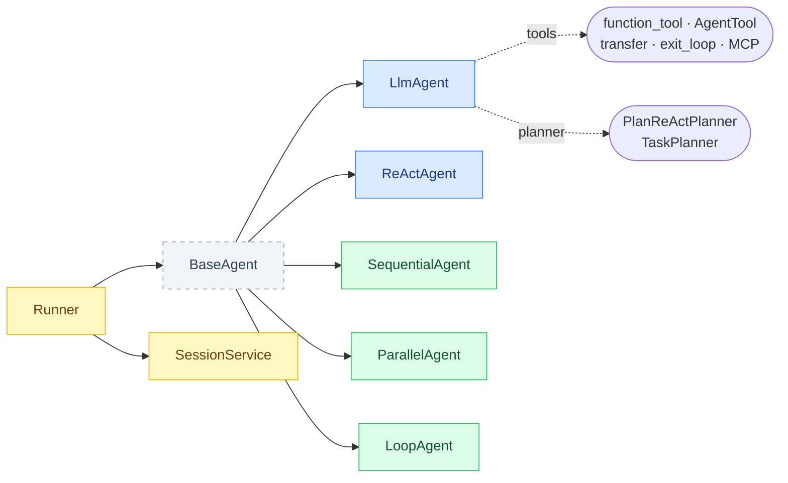
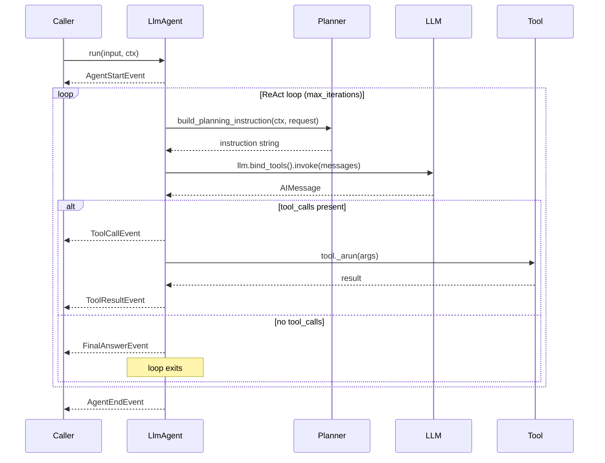
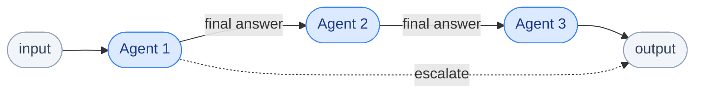
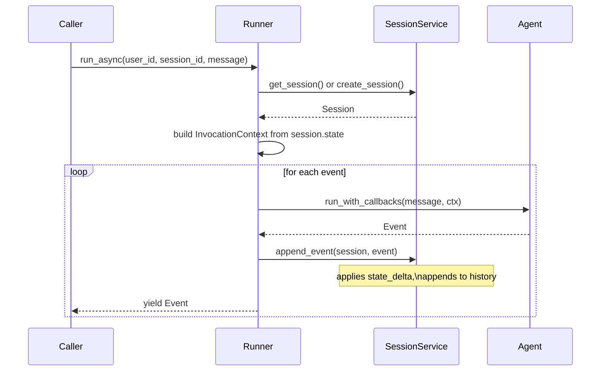

# langchain-adk

A LangChain-powered Agent Development Toolkit — async event-streaming agents, composable hierarchies, session management, planners, skills, MCP and A2A integration.

---

## Table of Contents

- [Overview](#overview)
- [Installation](#installation)
- [Quick Start](#quick-start)
- [Core Concepts](#core-concepts)
  - [Agents](#agents)
  - [Events](#events)
  - [Runner & Sessions](#runner--sessions)
  - [InvocationContext](#invocationcontext)
  - [Tools](#tools)
  - [Planners](#planners)
  - [Skills](#skills)
  - [Prompts](#prompts)
  - [Streaming](#streaming)
  - [Callbacks](#callbacks)
- [Composite Agents](#composite-agents)
  - [SequentialAgent](#sequentialagent)
  - [ParallelAgent](#parallelagent)
  - [LoopAgent](#loopagent)
- [Agent-to-Agent (A2A) Server](#agent-to-agent-a2a-server)
- [MCP Integration](#mcp-integration)
- [Architecture](#architecture)
- [Development](#development)

---

## Overview

`langchain-adk` gives you a structured way to build production-quality agents on top of any LangChain-compatible LLM. The core ideas:

- **Async event stream**: every agent is an `async def run()` that yields typed `Event` objects — thoughts, tool calls, results, final answers.
- **Composable hierarchy**: agents nest freely. Wrap a sub-agent as a tool (`AgentTool`), chain them (`SequentialAgent`), run them in parallel (`ParallelAgent`), or loop until done (`LoopAgent`).
- **Manual tool-call loop**: `LlmAgent` drives its own ReAct loop using `llm.bind_tools()` — no LangGraph, no hidden graphs.
- **Planners**: inject per-turn planning instructions and post-process responses before the agent acts.
- **Sessions**: pluggable `BaseSessionService` persists every event and state delta automatically via the `Runner`.
- **First-class streaming**: `RunConfig(streaming_mode=StreamingMode.SSE)` switches the LLM call to `astream()` and yields `partial=True` events for real-time UIs.



---

## Installation

```bash
pip install langchain-adk

# or with uv
uv add langchain-adk
```

You also need a LangChain LLM provider:

```bash
pip install langchain-openai       # ChatOpenAI
pip install langchain-anthropic    # ChatAnthropic
pip install langchain-google-genai # ChatGoogleGenerativeAI
```

**Python >= 3.10 required.**

---

## Quick Start

```python
import asyncio
from langchain_anthropic import ChatAnthropic
from langchain_core.tools import tool

from langchain_adk import LlmAgent, Runner, InMemorySessionService, RunConfig

@tool
def get_weather(city: str) -> str:
    """Get the current weather for a city."""
    return f"The weather in {city} is sunny and 22 degrees."

agent = LlmAgent(
    name="WeatherAgent",
    llm=ChatAnthropic(model="claude-3-5-haiku-latest"),
    tools=[get_weather],
    instructions="You are a helpful weather assistant.",
)

runner = Runner(
    agent=agent,
    app_name="demo",
    session_service=InMemorySessionService(),
)

async def main():
    async for event in runner.run_async(
        user_id="user-1",
        session_id="session-1",
        new_message="What's the weather in Copenhagen and Berlin?",
    ):
        if event.is_final_response():
            print(event.answer)

asyncio.run(main())
```

---

## Core Concepts

### Agents

All agents inherit from `BaseAgent` and implement a single method:

```python
async def run(self, input: str, *, ctx: InvocationContext) -> AsyncIterator[Event]:
    ...
```

The `run_with_callbacks()` wrapper fires `before_agent_callback` / `after_agent_callback` hooks and emits `AGENT_START` / `AGENT_END` events around `run()`.

#### LlmAgent

The primary agent. Uses LangChain `BaseChatModel` with a manual tool-call loop.



```python
from langchain_adk import LlmAgent

agent = LlmAgent(
    name="MyAgent",
    llm=llm,
    tools=[search_tool, calculator_tool],
    instructions="You are a research assistant.",   # or a Callable[[ReadonlyContext], str]
    description="Searches and calculates things.",
    planner=my_planner,         # optional BasePlanner
    output_schema=MySchema,     # optional: force structured output
    max_iterations=10,
    before_model_callback=None,
    after_model_callback=None,
    before_tool_callback=None,
    after_tool_callback=None,
)
```

The `instructions` parameter accepts either a plain string or an instruction provider — a callable that receives a `ReadonlyContext` and returns a string. This lets you build dynamic prompts per-turn:

```python
def my_instructions(ctx: ReadonlyContext) -> str:
    user_name = ctx.state.get("user_name", "user")
    return f"You are helping {user_name}. Be concise."

agent = LlmAgent(name="Agent", llm=llm, instructions=my_instructions)
```

#### ReActAgent

A structured-reasoning variant that forces the LLM to emit explicit thought steps via `with_structured_output()` before acting.

```python
from langchain_adk import ReActAgent

agent = ReActAgent(
    name="ThinkingAgent",
    llm=llm,
    tools=[search_tool],
    max_iterations=10,
)
```

Yields: `ThoughtEvent` -> `ActionEvent` -> `ObservationEvent` -> ... -> `FinalAnswerEvent`.

---

### Events

Every agent yields a stream of typed `Event` objects:

| Event type | When emitted | Key fields |
|---|---|---|
| `AgentStartEvent` | Start of `run_with_callbacks()` | `agent_name` |
| `AgentEndEvent` | End of `run_with_callbacks()` | `agent_name` |
| `ThoughtEvent` | ReActAgent reasoning step | `thought`, `scratchpad` |
| `ActionEvent` | ReActAgent action decision | `action`, `action_input` |
| `ObservationEvent` | ReActAgent tool result | `observation`, `tool_name` |
| `ToolCallEvent` | LlmAgent tool invocation | `tool_name`, `tool_input`, `llm_response` |
| `ToolResultEvent` | Tool execution result | `tool_name`, `result`, `error` |
| `FinalAnswerEvent` | Agent's final response | `answer`, `scratchpad`, `llm_response`, `partial` |
| `ErrorEvent` | Unhandled exception | `message`, `exception_type` |

Events carry `EventActions` for side-effects:

```python
class EventActions(BaseModel):
    state_delta: dict[str, Any] = {}     # merged into session state
    transfer_to_agent: str | None = None # trigger agent handoff
    escalate: bool | None = None         # stop parent LoopAgent
    skip_summarization: bool | None = None
    end_of_agent: bool | None = None
    compaction: EventCompaction | None = None
```

`FinalAnswerEvent` and `ToolCallEvent` carry an `llm_response: LlmResponse` field with token usage and model version:

```python
event.llm_response.input_tokens
event.llm_response.output_tokens
event.llm_response.model_version
```

---

### Runner & Sessions

`Runner` is the main entry point for session-managed execution. It wires an agent, a session service, and the invocation context together.

```python
from langchain_adk import Runner, InMemorySessionService, RunConfig, StreamingMode

runner = Runner(
    agent=agent,
    app_name="my-app",
    session_service=InMemorySessionService(),
)

# Non-streaming (default)
async for event in runner.run_async(
    user_id="user-1",
    session_id="session-abc",
    new_message="Hello!",
):
    ...

# SSE streaming — yields partial FinalAnswerEvents as text arrives
async for event in runner.run_async(
    user_id="user-1",
    session_id="session-abc",
    new_message="Hello!",
    run_config=RunConfig(streaming_mode=StreamingMode.SSE),
):
    if isinstance(event, FinalAnswerEvent) and event.partial:
        print(event.answer, end="", flush=True)
```

`Runner` automatically:
1. Fetches or creates the session
2. Builds an `InvocationContext` from the session state
3. Persists every event to the session via `append_event()`
4. Applies `EventActions.state_delta` to the session state

#### Sessions directly

```python
from langchain_adk import InMemorySessionService

svc = InMemorySessionService()
session = await svc.create_session(app_name="demo", user_id="user-1")

# All sessions for a user
sessions = await svc.list_sessions(app_name="demo", user_id="user-1")

# Delete
await svc.delete_session(session.id)
```

Implement `BaseSessionService` to back sessions with any database.

---

### InvocationContext

`InvocationContext` is the runtime state passed through every agent in the call tree. It carries the session binding, a mutable shared state dict, and run config.

```python
from langchain_adk import InvocationContext

ctx = InvocationContext(
    session_id="session-1",
    user_id="user-1",
    app_name="my-app",
    agent_name="RootAgent",
    state={"user_name": "Alice"},
)
```

Sub-agents receive a **derived** context with their own `agent_name` and `branch` for isolation, while sharing the same `state` reference:

```python
child_ctx = ctx.derive(agent_name="ChildAgent", branch_suffix="child")
# child_ctx.branch == "RootAgent.child"
# child_ctx.state is ctx.state  <- shared reference
```

Read-only and callback views:

```python
from langchain_adk import ReadonlyContext, CallbackContext

# Planners and instruction providers receive ReadonlyContext
# state is exposed as MappingProxyType — no accidental mutations
def instructions(ctx: ReadonlyContext) -> str:
    return f"Help {ctx.state['user_name']}."

# Callbacks receive CallbackContext — state is mutable, actions available
async def after_model(ctx: CallbackContext, response: LlmResponse) -> None:
    ctx.state["last_model"] = response.model_version
    ctx.actions.state_delta["last_model"] = response.model_version
```

---

### Tools

```mermaid
flowchart LR
    classDef agent fill:#dbeafe,stroke:#3b82f6,color:#1e3a8a
    classDef tool fill:#f3e8ff,stroke:#a855f7,color:#581c87
    classDef effect fill:#fff7ed,stroke:#f97316,color:#7c2d12
    classDef external fill:#f0fdf4,stroke:#22c55e,color:#14532d

    A([LlmAgent]):::agent

    A --> FT[function_tool]:::tool
    A --> AT[AgentTool]:::tool
    A --> TT[make_transfer_tool]:::tool
    A --> EL[exit_loop_tool]:::tool
    A --> MCP[MCPToolAdapter]:::tool

    FT -->|wraps| Fn("async def fn()"]:::external
    AT -->|invokes| SA([sub-agent]):::agent
    SA -->|derive context\nbranch isolation| IC["InvocationContext\n.derive()"]:::effect
    TT -->|sets| EA1["EventActions\n.transfer_to_agent"]:::effect
    EL -->|sets| EA2["EventActions\n.escalate = True"]:::effect
    MCP -->|fetches from| MS[("MCP Server")]:::external
```

#### Function tools

Wrap any async function as a LangChain `BaseTool`:

```python
from langchain_adk import function_tool

async def search_web(query: str) -> str:
    """Search the web and return results."""
    ...

tool = function_tool(search_web)
# or: function_tool(search_web, name="web_search", description="...")
```

Or use LangChain's `@tool` decorator directly — both work with `LlmAgent`.

#### AgentTool — sub-agents as tools

Wrap a `BaseAgent` so it can be called as a tool by a parent agent:

```python
from langchain_adk import AgentTool

research_tool = AgentTool(research_agent)
# The parent agent can call "ResearchAgent" as a tool.
# The tool derives a child context with branch isolation automatically.
```

#### Transfer tool — explicit agent handoff

```python
from langchain_adk import make_transfer_tool

transfer = make_transfer_tool([billing_agent, support_agent, tech_agent])
# The LLM can call "transfer_to_agent" with the target agent name.
# EventActions.transfer_to_agent is set; the parent routes accordingly.
```

#### Exit loop tool

Signal a `LoopAgent` to stop iterating:

```python
from langchain_adk import exit_loop_tool

loop_agent = LoopAgent(
    name="RefineLoop",
    agents=[refine_agent],
    # refine_agent has exit_loop_tool in its tools list
)
```

#### ToolContext

Inside a tool's `_arun()`, use `ToolContext` to read/write agent state:

```python
from langchain_adk import ToolContext

class MyStatefulTool(BaseTool):
    _ctx: ToolContext | None = None

    def inject_context(self, ctx: InvocationContext) -> None:
        self._ctx = ToolContext(ctx)

    async def _arun(self, query: str) -> str:
        self._ctx.state["last_query"] = query
        return "done"
```

`LlmAgent` automatically calls `inject_context()` on any tool that exposes it before each tool execution.

---

### Planners

Planners inject planning instructions into the system prompt before each LLM call and can post-process the response.

```python
from langchain_adk import BasePlanner, ReadonlyContext, LlmRequest, LlmResponse

class MyPlanner(BasePlanner):
    def build_planning_instruction(
        self, ctx: ReadonlyContext, request: LlmRequest
    ) -> str | None:
        return "Think step by step before acting. Plan before calling tools."

    def process_planning_response(
        self, ctx: ReadonlyContext, response: LlmResponse
    ) -> LlmResponse | None:
        return None  # no post-processing needed
```

#### PlanReActPlanner

A built-in planner that enforces structured planning tags — the agent must emit a `/*PLANNING*/` block before reasoning and a `/*FINAL_ANSWER*/` block to conclude.

```python
from langchain_adk import PlanReActPlanner, LlmAgent

agent = LlmAgent(
    name="PlanningAgent",
    llm=llm,
    tools=[...],
    planner=PlanReActPlanner(),
)
```

#### TaskPlanner

Maintains a task board in `ctx.state` and injects its current status into the system prompt. Pairs with `ManageTasksTool` so the agent can create, update, complete, and list tasks.

```python
from langchain_adk import TaskPlanner, LlmAgent

planner = TaskPlanner()

agent = LlmAgent(
    name="ProjectAgent",
    llm=llm,
    tools=[planner.get_manage_tasks_tool()],
    planner=planner,
    instructions=(
        "Track your work with manage_tasks. "
        "Initialize tasks at the start. Mark each complete when done."
    ),
)
```

The agent can call `manage_tasks` with actions: `initialize`, `list`, `create`, `update`, `complete`, `remove`.

---

### Skills

Skills are reusable instruction blocks that an agent can load dynamically at runtime.

```python
from langchain_adk import Skill, InMemorySkillStore
from langchain_adk.skills.load_skill_tool import make_load_skill_tool, make_list_skills_tool

store = InMemorySkillStore([
    Skill(
        name="summarization",
        description="How to write concise summaries.",
        content="Extract the 3-5 most important points. Use bullet points. Be concise.",
    ),
    Skill(
        name="code_review",
        description="How to conduct a thorough code review.",
        content="Check correctness, readability, test coverage, and security.",
    ),
])

agent = LlmAgent(
    name="SkillfulAgent",
    llm=llm,
    tools=[
        make_list_skills_tool(store),   # lets agent discover available skills
        make_load_skill_tool(store),    # lets agent load a skill's full content
    ],
)
```

The agent calls `list_skills` to discover what's available, then `load_skill("summarization")` to get the full instruction text. Implement `BaseSkillStore` for any backend.

---

### Prompts

The prompt catalog builds structured system prompts from a `PromptContext`:

```python
from langchain_adk import PromptContext, build_system_prompt

prompt = build_system_prompt(PromptContext(
    agent_name="WriterAgent",
    goal="Write polished articles from research notes.",
    instructions="Use markdown. Structure with headings. Be thorough.",
    skills=[
        {"name": "AP Style", "content": "Follow AP style guide for all prose."}
    ],
    agents=[
        {"name": "ResearchAgent", "description": "Retrieves research on any topic."}
    ],
    workflow_lines=[
        "1. Call ResearchAgent to gather background information.",
        "2. Outline the article structure.",
        "3. Write the full article.",
        "4. Review and refine.",
    ],
))

agent = LlmAgent(name="WriterAgent", llm=llm, instructions=prompt)
```

Sections are only included when non-empty — no boilerplate padding.

---

### Streaming

Enable SSE streaming to get incremental text as the LLM generates it:

```python
from langchain_adk import RunConfig, StreamingMode

async for event in runner.run_async(
    user_id="user-1",
    session_id="session-1",
    new_message="Write me a long essay about distributed systems.",
    run_config=RunConfig(streaming_mode=StreamingMode.SSE),
):
    if isinstance(event, FinalAnswerEvent):
        if event.partial:
            # Stream chunk to the client (WebSocket, SSE endpoint, etc.)
            print(event.answer, end="", flush=True)
        else:
            # Final complete event
            print(f"\n[DONE] tokens: {event.llm_response.output_tokens}")
```

Partial events are suppressed automatically if the LLM decides to call a tool instead of answering — only real text chunks are streamed.

---

### Callbacks

Attach hooks at the agent, model, and tool level:

```python
from langchain_adk import InvocationContext, LlmRequest, LlmResponse

async def log_llm_call(ctx: InvocationContext, request: LlmRequest) -> None:
    print(f"[{ctx.agent_name}] LLM call with {len(request.messages)} messages")

async def track_usage(ctx: InvocationContext, response: LlmResponse) -> None:
    print(f"Tokens: {response.input_tokens} in / {response.output_tokens} out")

async def log_tool(ctx: InvocationContext, name: str, args: dict) -> None:
    print(f"[TOOL] {name}({args})")

agent = LlmAgent(
    name="TrackedAgent",
    llm=llm,
    before_model_callback=log_llm_call,
    after_model_callback=track_usage,
    before_tool_callback=log_tool,
)
```

Agent-level hooks:

```python
async def on_start(ctx: InvocationContext) -> None:
    print(f"Agent {ctx.agent_name} starting")

agent.before_agent_callback = on_start
```

---

## Composite Agents

### SequentialAgent

Chains sub-agents in order. The final answer of each agent becomes the input to the next.



```python
from langchain_adk import SequentialAgent

pipeline = SequentialAgent(
    name="ResearchWriterPipeline",
    agents=[research_agent, writer_agent, editor_agent],
)

async for event in pipeline.run("Write about quantum computing", ctx=ctx):
    ...
```

Stops early if any event carries `actions.escalate=True`.

### ParallelAgent

Runs sub-agents concurrently. Events from all agents are merged into a single stream.


```python
from langchain_adk import ParallelAgent

parallel = ParallelAgent(
    name="MultiSourceResearch",
    agents=[web_agent, academic_agent, news_agent],
)

async for event in parallel.run("Find info about fusion energy", ctx=ctx):
    # Events arrive from all three agents, tagged by agent_name
    print(f"[{event.agent_name}] {event.type}")
```

Each sub-agent gets a derived context with an isolated branch (`parallel.web_agent`, `parallel.academic_agent`, etc.) so their state and events don't collide.

### LoopAgent

Repeats its sub-agents until a termination condition is met.


```python
from langchain_adk import LoopAgent, exit_loop_tool

refine_agent = LlmAgent(
    name="RefineAgent",
    llm=llm,
    tools=[edit_tool, exit_loop_tool],
    instructions=(
        "Improve the draft. Call exit_loop when the quality is acceptable. "
        "Otherwise call the edit tool and keep refining."
    ),
)

loop = LoopAgent(
    name="RefinementLoop",
    agents=[refine_agent],
    max_iterations=5,
)

async for event in loop.run(draft_text, ctx=ctx):
    ...
```

`LoopAgent` stops when:
- An event has `actions.escalate=True` (set by `exit_loop_tool`)
- `max_iterations` is reached
- Optional `should_continue(event) -> bool` callback returns `False`

---

## Agent-to-Agent (A2A) Server

Expose any agent as an HTTP endpoint with Server-Sent Events:

```python
import uvicorn
from langchain_adk import LlmAgent, InMemorySessionService
from langchain_adk.a2a import A2AServer

agent = LlmAgent(name="MyAgent", llm=llm, tools=[...])

server = A2AServer(
    agent=agent,
    session_service=InMemorySessionService(),
    app_name="my-agent-service",
)

app = server.as_fastapi_app()
# uvicorn my_module:app --host 0.0.0.0 --port 8000
```

Clients send `POST /run` with a JSON body and receive an SSE stream of agent events. Combine with `AgentTool` or `make_transfer_tool` to wire agents across services.

---

## MCP Integration

Connect to any MCP-compatible tool server and use its tools inside any agent:

```python
from langchain_adk.integrations.mcp import MCPClient, MCPToolAdapter

async def build_agent_with_mcp():
    client = MCPClient(server_url="http://localhost:8001")
    adapter = MCPToolAdapter()

    mcp_tools = await adapter.load_tools(client)

    agent = LlmAgent(
        name="MCPAgent",
        llm=llm,
        tools=mcp_tools,
        instructions="Use the available tools to answer questions.",
    )
    return agent
```

`MCPToolAdapter.load_tools()` fetches the tool list from the MCP server and wraps each as a LangChain `BaseTool`.

---

## Architecture




**Key design decisions:**

- No LangGraph — orchestration is plain Python `asyncio` and async generators.
- `InvocationContext.state` is a shared mutable dict across the call tree. Use `EventActions.state_delta` to persist changes back to the session.
- `LlmRequest` / `LlmResponse` isolate LangChain types from the rest of the SDK. Swap the LLM provider without touching agent logic.
- Planners are per-turn hooks, not static prompts. They receive the live context and request so they can make dynamic decisions each turn.

---

## Development

```bash
# Clone and install with uv
git clone <repo-url>
cd agent-sdk
uv sync

# Run tests
uv run pytest tests/ -v

# Run an example (set your API key first)
export ANTHROPIC_API_KEY=sk-ant-...
uv run python examples/basic_agent.py
```

**Adding a custom session backend:**

```python
from langchain_adk.sessions import BaseSessionService, Session

class RedisSessionService(BaseSessionService):
    async def create_session(self, *, app_name, user_id, state=None, session_id=None) -> Session: ...
    async def get_session(self, *, app_name, user_id, session_id) -> Session | None: ...
    async def update_session(self, session_id, *, state) -> Session: ...
    async def delete_session(self, session_id) -> None: ...
    async def list_sessions(self, *, app_name, user_id) -> list[Session]: ...
```

**Adding a custom planner:**

```python
from langchain_adk import BasePlanner, ReadonlyContext, LlmRequest

class MyPlanner(BasePlanner):
    def build_planning_instruction(self, ctx: ReadonlyContext, request: LlmRequest) -> str | None:
        # Return a string to append to the system prompt, or None to skip
        return "Always verify your answer before responding."
```

Pass it to any `LlmAgent` via `planner=MyPlanner()`.
