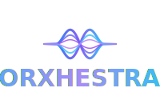

<p align="center">
  
</p>

<p align="center">
  <strong>Multi-agent orchestration framework for Python.</strong>
</p>

<p align="center">
  <a href="https://pypi.org/project/orxhestra/"></a>
  <a href="https://pypi.org/project/orxhestra/"></a>
  <a href="https://github.com/NicolaiLassen/orxhestra/blob/main/LICENSE"></a>
</p>

<br>

Compose multi-agent AI systems with async event streaming, agent hierarchies, and built-in support for MCP and A2A protocols.

## Quickstart

```bash
pip install orxhestra
# or
uv add orxhestra
```

```python
from orxhestra import LlmAgent, Runner, InMemorySessionService

agent = LlmAgent(
    name="assistant",
    model="gpt-5.4",
    instructions="You are a helpful assistant.",
)

runner = Runner(agent=agent, session_service=InMemorySessionService())
response = await runner.run(user_id="user1", session_id="s1", new_message="Hello!")

for event in response:
    print(event.content)
```

> [!TIP]
> For full documentation, guides, and API reference, visit [orxhestra.com](https://orxhestra.com).

## Features

- **Agent ensemble** - LLM, ReAct, Sequential, Parallel, and Loop agents
- **Event streaming** - Async event-driven architecture with real-time streaming
- **Composer** - Conduct entire agent orchestras declaratively with YAML
- **Tools** - Function tools, filesystem tools, agent-as-tool, shell, and long-running tool support
- **Planners** - Choreograph task execution with PlanReAct and TaskPlanner strategies
- **Skills** - Reusable, composable agent repertoires
- **MCP** - Model Context Protocol integration for tool servers
- **A2A** - Agent-to-Agent protocol for cross-service harmonization
- **Memory** - Pluggable memory stores for persistent agent context
- **Tracing** - Built-in support for Langfuse, LangSmith, and custom callbacks

## Agents at a glance

| Agent | Description |
|-------|-------------|
| `LlmAgent` | Chat model agent with tools, instructions, and structured output |
| `ReActAgent` | Reasoning + acting loop with automatic tool use |
| `SequentialAgent` | Runs sub-agents in order |
| `ParallelAgent` | Runs sub-agents concurrently |
| `LoopAgent` | Repeats a sub-agent until exit condition |
| `A2AAgent` | Connects to remote agents via A2A protocol |

## Composer

Define entire agent orchestras in a single YAML file — no Python wiring needed. Compose LLM agents, loops, pipelines, tools, and review cycles declaratively. The example below builds a coding agent that plans, implements with filesystem + shell access, and self-reviews in a loop:

```yaml
defaults:
  model:
    provider: openai
    name: gpt-5.4

tools:
  exit:
    builtin: "exit_loop"
  filesystem:
    builtin: "filesystem"
  shell:
    builtin: "shell"

agents:
  planner:
    type: llm
    description: "Plans the implementation steps for the coder agent."
    instructions: |
      Output a numbered list of concrete steps the coder
      should execute. Each step must be an actionable file
      operation or shell command.

  coder:
    type: llm
    description: "Implements code changes with filesystem and shell access."
    instructions: |
      Follow the plan from the previous step exactly.
      Use filesystem tools to create files and shell to
      run commands. Never ask the user to do anything.
    tools:
      - filesystem
      - shell

  reviewer:
    type: llm
    description: "Reviews changes and approves or requests fixes."
    instructions: |
      Check files exist and look correct. If done, call
      exit_loop. Otherwise describe what needs fixing.
    tools:
      - exit

  dev_loop:
    type: loop
    agents: [coder, reviewer]
    max_iterations: 10

  coordinator:
    type: sequential
    agents: [planner, dev_loop]

main_agent: coordinator

runner:
  app_name: coding-agent
  session_service: memory
```

```bash
orxhestra compose.yaml
```

## Docker

```bash
docker run -e OPENAI_API_KEY=$OPENAI_API_KEY \
  -v ./compose.yaml:/app/compose.yaml \
  nicolaimtlassen/orxhestra
```

## Documentation

- [Getting Started](https://orxhestra.com/getting-started/quickstart) - Installation and first agent
- [Agents](https://orxhestra.com/concepts/agents) - Agent types and configuration
- [Tools](https://orxhestra.com/tools/overview) - Built-in and custom tools
- [Composer](https://orxhestra.com/composer/overview) - YAML-based agent composition
- [Integrations](https://orxhestra.com/integrations/mcp) - MCP and A2A setup

---

## Acknowledgments

This project is built on the shoulders of several outstanding open-source projects and research efforts:

- [LangChain](https://github.com/langchain-ai/langchain)
- [Google Agent Development Kit (ADK)](https://github.com/google/adk-python)
- [LangGraph](https://github.com/langchain-ai/langgraph)
- [Model Context Protocol (MCP)](https://modelcontextprotocol.io)
- [Agent-to-Agent Protocol (A2A)](https://github.com/google/A2A)

Special thanks to the open-source AI community for pushing the boundaries of what's possible with agent frameworks.
