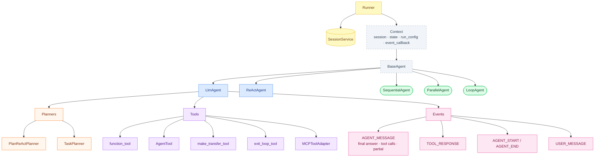
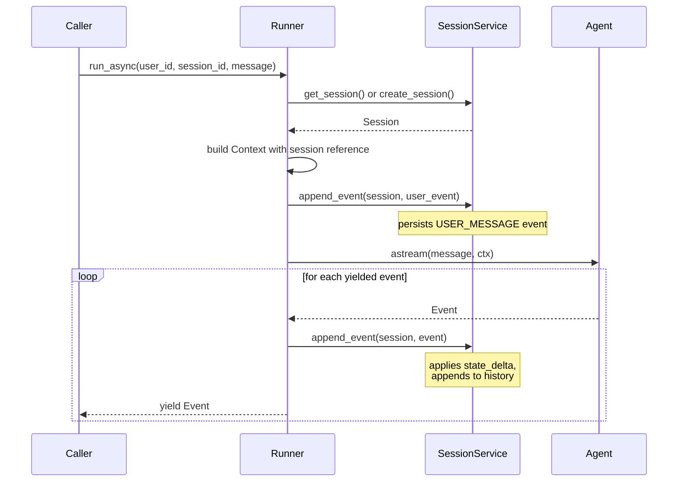

# Architecture



## Request lifecycle



## Key design decisions

- **No LangGraph** — orchestration is plain Python `asyncio` and async generators.
- **`Context.state`** is a shared mutable dict across the call tree. Use `EventActions.state_delta` to persist changes back to the session.
- **`Context.event_callback`** enables real-time event streaming from tools. `LlmAgent` injects an `asyncio.Queue`-based callback before tool execution; `AgentTool` uses it to push sub-agent events as they arrive. Any custom tool can use the same mechanism.
- **`LlmRequest` / `LlmResponse`** isolate LangChain types from the rest of the SDK. Swap the LLM provider without touching agent logic.
- **Planners are per-turn hooks**, not static prompts. They receive the live context and request so they can make dynamic decisions each turn.

## Custom session backend

```python
from langchain_adk.sessions import BaseSessionService, Session

class RedisSessionService(BaseSessionService):
    async def create_session(self, *, app_name, user_id, state=None, session_id=None) -> Session: ...
    async def get_session(self, *, app_name, user_id, session_id) -> Session | None: ...
    async def update_session(self, session_id, *, state) -> Session: ...
    async def delete_session(self, session_id) -> None: ...
    async def list_sessions(self, *, app_name, user_id) -> list[Session]: ...
```

## Custom planner

```python
from langchain_adk import BasePlanner, ReadonlyContext, LlmRequest

class MyPlanner(BasePlanner):
    def build_planning_instruction(self, ctx: ReadonlyContext, request: LlmRequest) -> str | None:
        return "Always verify your answer before responding."
```

Pass it to any `LlmAgent` via `planner=MyPlanner()`.
