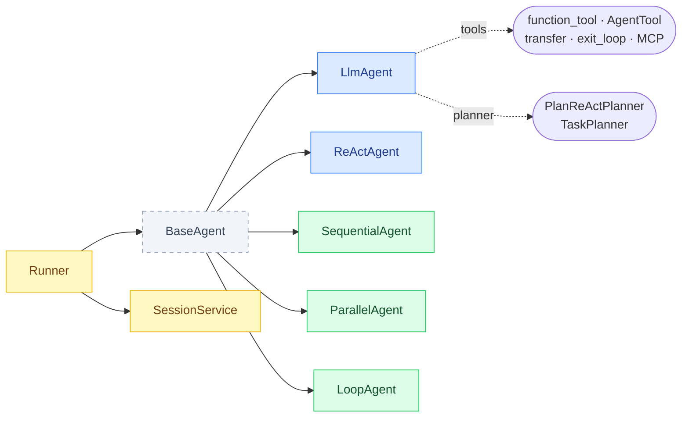
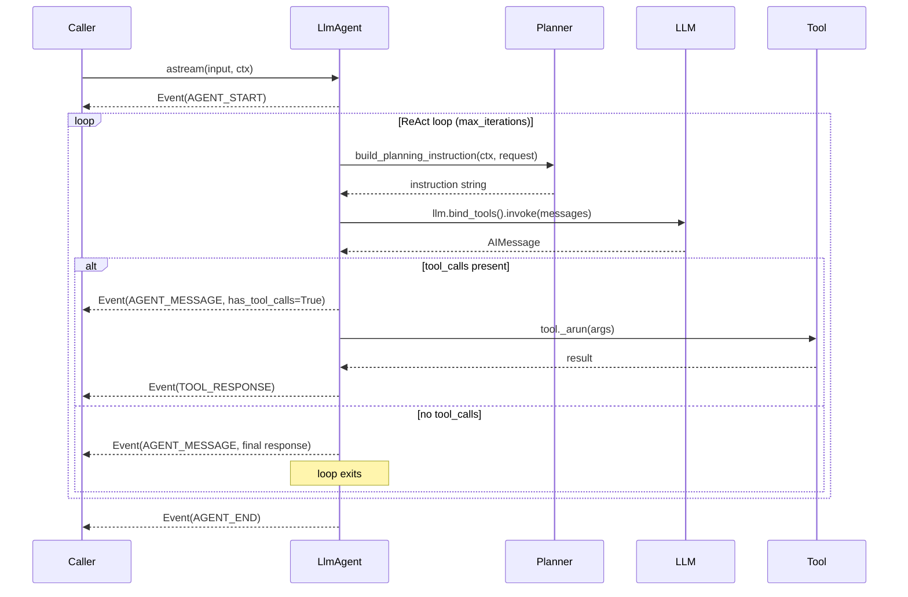

# Agents

All agents inherit from `BaseAgent` and implement a single method:

```python
async def astream(self, input: str, *, ctx: Context) -> AsyncIterator[Event]:
    ...
```

The `_run_with_callbacks()` wrapper fires `before_agent_callback` / `after_agent_callback` hooks and emits `AGENT_START` / `AGENT_END` events around `astream()`.



## LlmAgent

The primary agent. Uses LangChain `BaseChatModel` with a manual tool-call loop.



```python
from langchain_adk import LlmAgent

agent = LlmAgent(
    name="MyAgent",
    llm=llm,
    tools=[search_tool, calculator_tool],
    instructions="You are a research assistant.",   # or a Callable[[ReadonlyContext], str]
    description="Searches and calculates things.",
    planner=my_planner,         # optional BasePlanner
    output_schema=MySchema,     # optional: force structured output
    max_iterations=10,
    before_model_callback=None,
    after_model_callback=None,
    before_tool_callback=None,
    after_tool_callback=None,
)
```

### Dynamic instructions

The `instructions` parameter accepts either a plain string or an instruction provider — a callable that receives a `ReadonlyContext` and returns a string:

```python
def my_instructions(ctx: ReadonlyContext) -> str:
    user_name = ctx.state.get("user_name", "user")
    return f"You are helping {user_name}. Be concise."

agent = LlmAgent(name="Agent", llm=llm, instructions=my_instructions)
```

## ReActAgent

A structured-reasoning variant that forces the LLM to emit explicit thought steps via `with_structured_output()` before acting.

```python
from langchain_adk import ReActAgent

agent = ReActAgent(
    name="ThinkingAgent",
    llm=llm,
    tools=[search_tool],
    max_iterations=10,
)
```

Yields events with types: `AGENT_START` -> `AGENT_MESSAGE` (thoughts/actions) -> `TOOL_RESPONSE` (observations) -> ... -> `AGENT_MESSAGE` (final answer) -> `AGENT_END`.
