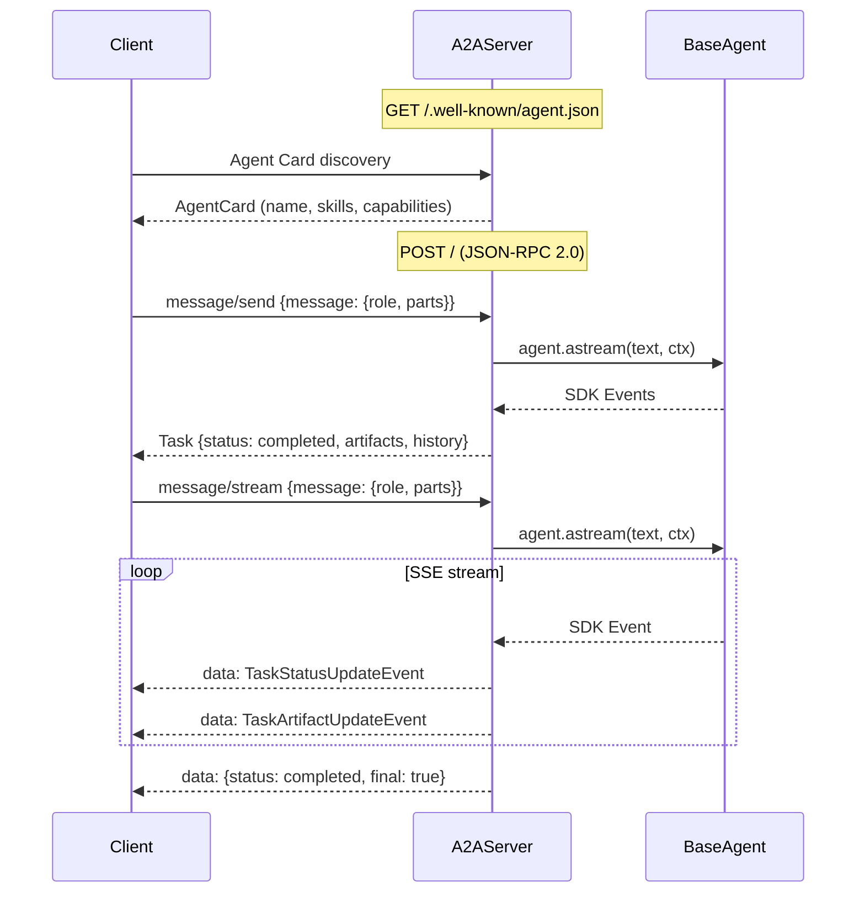

# Agent-to-Agent (A2A) Server

Expose any agent as a spec-compliant [A2A protocol](https://a2a-protocol.org/) endpoint (v0.3.0).



## Setup

```python
from langchain_adk import LlmAgent, InMemorySessionService
from langchain_adk.a2a import A2AServer, AgentSkill

agent = LlmAgent(name="MyAgent", llm=llm, tools=[...])

server = A2AServer(
    agent=agent,
    session_service=InMemorySessionService(),
    app_name="my-agent-service",
    skills=[
        AgentSkill(
            id="qa", name="Q&A",
            description="Answers general questions.",
            tags=["general"],
        ),
    ],
)

app = server.as_fastapi_app()
# uvicorn my_module:app --host 0.0.0.0 --port 8000
```

## Endpoints

| Method | Endpoint | Description |
|---|---|---|
| `GET` | `/.well-known/agent.json` | Agent Card discovery |
| `POST` | `/` | JSON-RPC 2.0 dispatch |

## JSON-RPC methods

| Method | Description |
|---|---|
| `message/send` | Send message, receive completed Task |
| `message/stream` | Send message, receive SSE stream |
| `tasks/get` | Retrieve task by ID |
| `tasks/cancel` | Cancel a running task |

## Example requests

=== "Discover"

    ```bash
    curl http://localhost:8000/.well-known/agent-card.json
    ```

=== "Send (blocking)"

    ```bash
    curl -X POST http://localhost:8000/ \
      -H "Content-Type: application/json" \
      -d '{
        "jsonrpc": "2.0", "id": "1",
        "method": "message/send",
        "params": {
          "message": {
            "role": "user",
            "parts": [{"kind": "text", "text": "What is 2+2?"}]
          }
        }
      }'
    ```

=== "Stream (SSE)"

    ```bash
    curl -N -X POST http://localhost:8000/ \
      -H "Content-Type: application/json" \
      -d '{
        "jsonrpc": "2.0", "id": "2",
        "method": "message/stream",
        "params": {
          "message": {
            "role": "user",
            "parts": [{"kind": "text", "text": "Tell me a story"}]
          }
        }
      }'
    ```
