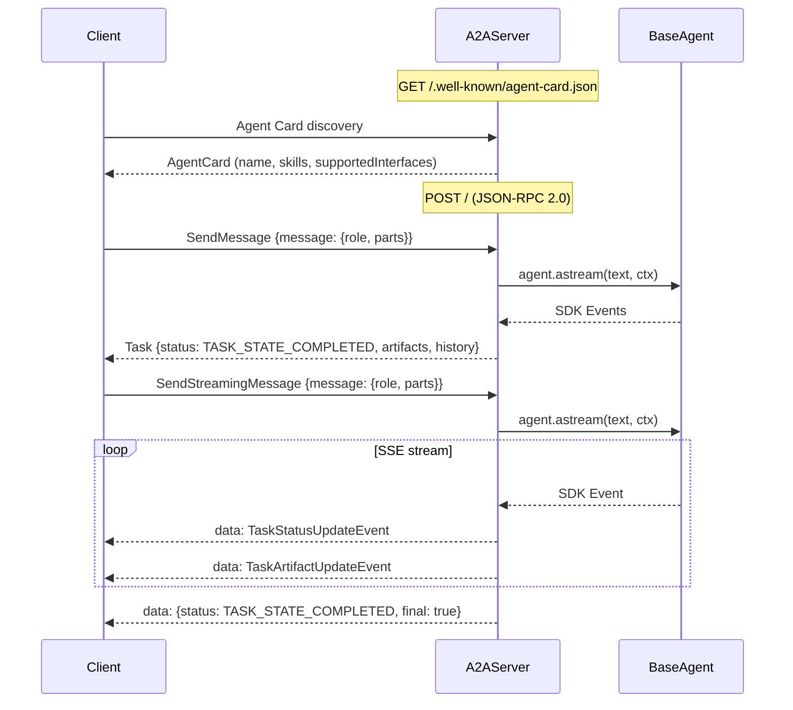

Expose any agent as a spec-compliant [A2A protocol](https://a2a-protocol.org/) endpoint (v1.0).



## Setup

```python
from langchain_adk import LlmAgent, InMemorySessionService
from langchain_adk.a2a import A2AServer, AgentSkill

agent = LlmAgent(name="MyAgent", llm=llm, tools=[...])

server = A2AServer(
    agent=agent,
    session_service=InMemorySessionService(),
    app_name="my-agent-service",
    skills=[
        AgentSkill(
            id="qa", name="Q&A",
            description="Answers general questions.",
            tags=["general"],
        ),
    ],
)

app = server.as_fastapi_app()
# uvicorn my_module:app --host 0.0.0.0 --port 8000
```

## Endpoints

| Method | Endpoint | Description |
|---|---|---|
| `GET` | `/.well-known/agent-card.json` | Agent Card discovery |
| `POST` | `/` | JSON-RPC 2.0 dispatch |

## JSON-RPC methods (v1.0)

| Method | Description |
|---|---|
| `SendMessage` | Send message, receive completed Task |
| `SendStreamingMessage` | Send message, receive SSE stream |
| `GetTask` | Retrieve task by ID |
| `CancelTask` | Cancel a running task |

<Note>
The server also accepts the legacy v0.x method names (`message/send`, `message/stream`, `tasks/get`, `tasks/cancel`) for backwards compatibility.
</Note>

## Example requests

<Tabs>
  <Tab title="Discover">
    ```bash
    curl http://localhost:8000/.well-known/agent-card.json
    ```
  </Tab>
  <Tab title="Send (blocking)">
    ```bash
    curl -X POST http://localhost:8000/ \
      -H "Content-Type: application/json" \
      -H "A2A-Version: 1.0" \
      -d '{
        "jsonrpc": "2.0", "id": "1",
        "method": "SendMessage",
        "params": {
          "message": {
            "role": "ROLE_USER",
            "parts": [{"text": "What is 2+2?", "mediaType": "text/plain"}]
          }
        }
      }'
    ```
  </Tab>
  <Tab title="Stream (SSE)">
    ```bash
    curl -N -X POST http://localhost:8000/ \
      -H "Content-Type: application/json" \
      -H "A2A-Version: 1.0" \
      -d '{
        "jsonrpc": "2.0", "id": "2",
        "method": "SendStreamingMessage",
        "params": {
          "message": {
            "role": "ROLE_USER",
            "parts": [{"text": "Tell me a story", "mediaType": "text/plain"}]
          }
        }
      }'
    ```
  </Tab>
</Tabs>

## A2A Client (A2AAgent)

Use `A2AAgent` to call a remote A2A server from within your agent tree:

```python
from langchain_adk.agents.a2a_agent import A2AAgent

remote = A2AAgent(
    name="RemoteAgent",
    url="http://localhost:8000",
    description="A remote agent via A2A protocol.",
)

# Use as a sub-agent or wrap with AgentTool
async for event in remote.astream("What is the weather?"):
    if event.is_final_response():
        print(event.text)
```

## v1.0 Protocol Details

A2A v1.0 uses:
- **PascalCase** JSON-RPC method names (`SendMessage`, not `message/send`)
- **SCREAMING_SNAKE_CASE** enum values (`ROLE_USER`, `TASK_STATE_COMPLETED`)
- **Unified Part type** with oneof content fields (`text`, `raw`, `url`, `data`) plus `mediaType`
- **`supportedInterfaces`** on AgentCard (replaces top-level `url`)
