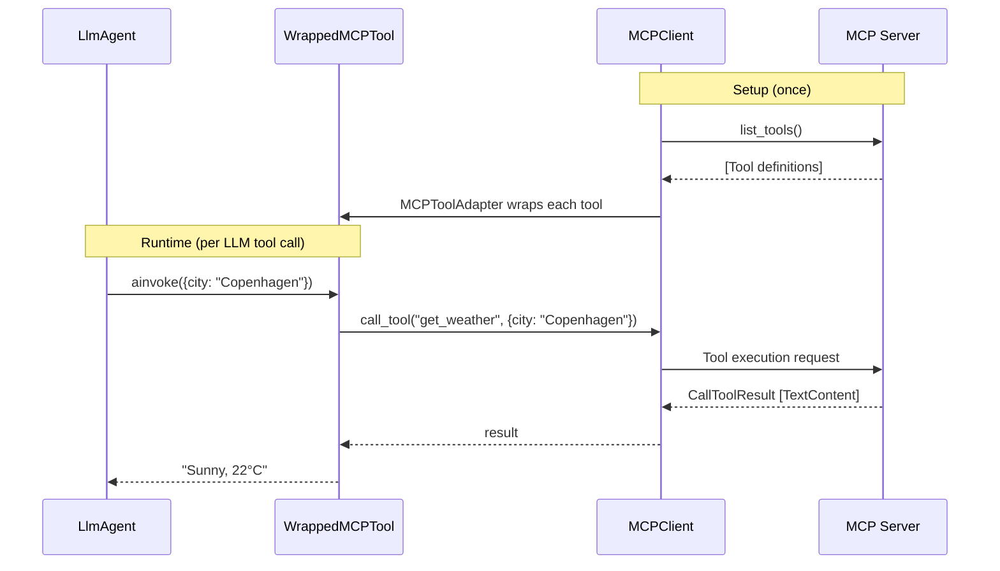

Install with MCP support:

```bash
pip install langchain-adk[mcp]
```

Connect to any MCP-compatible tool server and use its tools inside any agent.



## Usage

```python
from langchain_adk.integrations.mcp import MCPClient, MCPToolAdapter

# Connect to an MCP server (HTTP or in-memory)
client = MCPClient("http://localhost:8001/mcp")

# Wrap MCP tools as LangChain tools
adapter = MCPToolAdapter(client)
mcp_tools = await adapter.load_tools()

agent = LlmAgent(
    name="MCPAgent",
    llm=llm,
    tools=mcp_tools,
    instructions="Use the available tools to answer questions.",
)
```

## Testing with in-memory server

For testing, pass a fastMCP server object directly (no HTTP needed):

```python
from fastmcp import FastMCP

server = FastMCP("TestServer")

@server.tool
def add(a: int, b: int) -> int:
    """Add two numbers."""
    return a + b

client = MCPClient(server)  # in-memory, no network
adapter = MCPToolAdapter(client)
tools = await adapter.load_tools()
```

`MCPToolAdapter.load_tools()` fetches the tool list from the MCP server and wraps each as a LangChain `BaseTool`.
