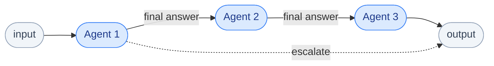
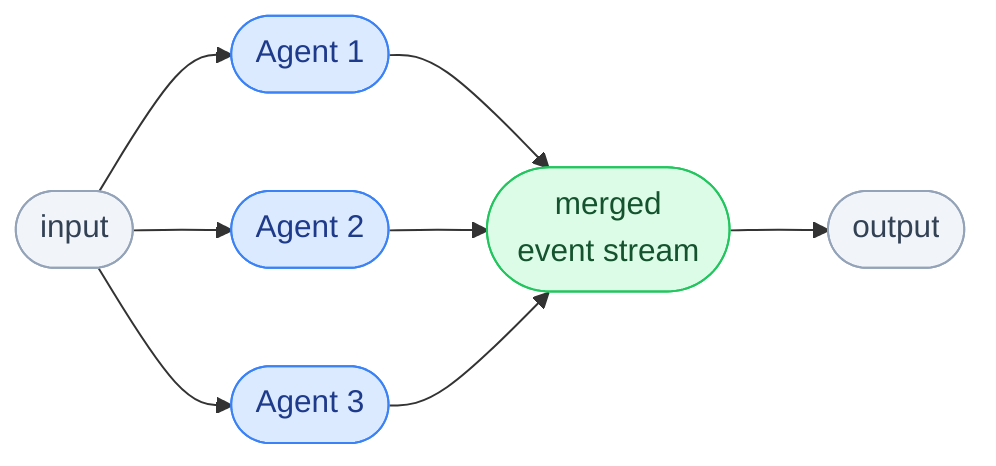
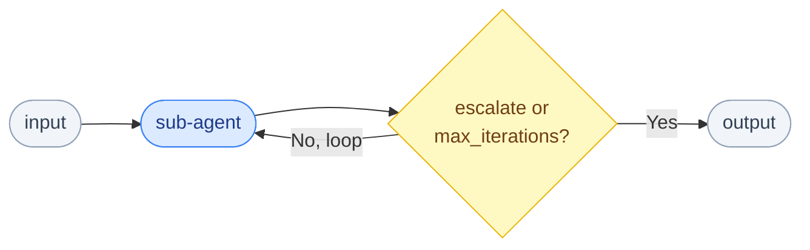

# Composite Agents

## SequentialAgent

Chains sub-agents in order. The final answer of each agent becomes the input to the next.



```python
from langchain_adk import SequentialAgent

pipeline = SequentialAgent(
    name="ResearchWriterPipeline",
    agents=[research_agent, writer_agent, editor_agent],
)

async for event in pipeline.run("Write about quantum computing", ctx=ctx):
    ...
```

Stops early if any event carries `actions.escalate=True`.

## ParallelAgent

Runs sub-agents concurrently. Events from all agents are merged into a single stream.



```python
from langchain_adk import ParallelAgent

parallel = ParallelAgent(
    name="MultiSourceResearch",
    agents=[web_agent, academic_agent, news_agent],
)

async for event in parallel.run("Find info about fusion energy", ctx=ctx):
    print(f"[{event.agent_name}] {event.type}")
```

Each sub-agent gets a derived context with an isolated branch so their state and events don't collide.

## LoopAgent

Repeats its sub-agents until a termination condition is met.



```python
from langchain_adk import LoopAgent, exit_loop_tool

refine_agent = LlmAgent(
    name="RefineAgent",
    llm=llm,
    tools=[edit_tool, exit_loop_tool],
    instructions=(
        "Improve the draft. Call exit_loop when the quality is acceptable. "
        "Otherwise call the edit tool and keep refining."
    ),
)

loop = LoopAgent(
    name="RefinementLoop",
    agents=[refine_agent],
    max_iterations=5,
)

async for event in loop.run(draft_text, ctx=ctx):
    ...
```

`LoopAgent` stops when:

- An event has `actions.escalate=True` (set by `exit_loop_tool`)
- `max_iterations` is reached
- Optional `should_continue(event) -> bool` callback returns `False`
