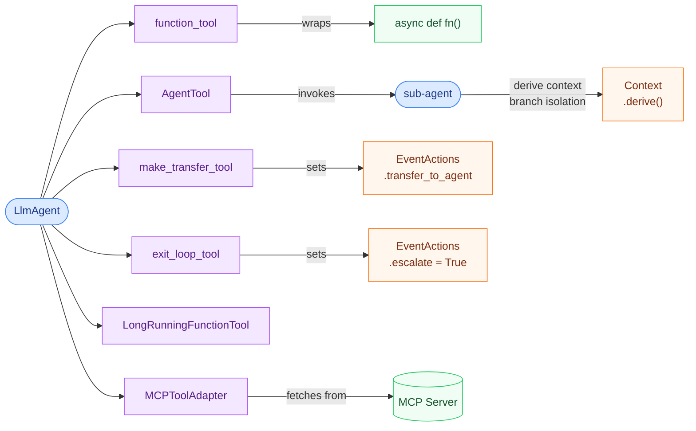

## Function tools

Wrap any async function as a LangChain `BaseTool`:

```python
from langchain_adk import function_tool

async def search_web(query: str) -> str:
    """Search the web and return results."""
    ...

tool = function_tool(search_web)
# or: function_tool(search_web, name="web_search", description="...")
```

Or use LangChain's `@tool` decorator directly — both work with `LlmAgent`.

## AgentTool — sub-agents as tools

Wrap a `BaseAgent` so it can be called as a tool by a parent agent:

```python
from langchain_adk import LlmAgent
from langchain_adk.tools.agent_tool import AgentTool

research_agent = LlmAgent(name="ResearchAgent", llm=llm, tools=[search_tool])

parent = LlmAgent(
    name="Coordinator",
    llm=llm,
    tools=[AgentTool(research_agent)],
    instructions="Delegate research to ResearchAgent.",
)
```

The tool derives a child context with branch isolation and a clean session automatically. Sub-agent events stream through the parent in real-time via `ctx.event_callback` — each event carries a `branch` field (e.g. `"ResearchAgent"`) for attribution.

### AgentTool callbacks

Hook into the child agent's event stream with `before_agent_callback` (intercept each event, optionally short-circuit) and `after_agent_callback` (run after completion):

```python
def check_event(event, child_ctx):
    if child_ctx.state.get("needs_approval"):
        return "Paused: awaiting approval."  # short-circuits, returns this as tool result
    return None  # continue

tool = AgentTool(research_agent, before_agent_callback=check_event)
```

Any custom tool can push events the same way:

```python
if ctx.event_callback is not None:
    ctx.event_callback(my_event)
```

## Transfer tool — explicit agent handoff

```python
from langchain_adk import make_transfer_tool

transfer = make_transfer_tool([billing_agent, support_agent, tech_agent])
# The LLM can call "transfer_to_agent" with the target agent name.
# EventActions.transfer_to_agent is set; the parent routes accordingly.
```

## Exit loop tool

Signal a `LoopAgent` to stop iterating:

```python
from langchain_adk import exit_loop_tool

loop_agent = LoopAgent(
    name="RefineLoop",
    agents=[refine_agent],
    # refine_agent has exit_loop_tool in its tools list
)
```

## ToolContext

Inside a tool's `_arun()`, use `ToolContext` to read/write agent state:

```python
from langchain_adk import ToolContext

class MyStatefulTool(BaseTool):
    _ctx: ToolContext | None = None

    def inject_context(self, ctx: Context) -> None:
        self._ctx = ToolContext(ctx)

    async def _arun(self, query: str) -> str:
        self._ctx.state["last_query"] = query
        return "done"
```

`LlmAgent` automatically calls `inject_context()` on any tool that exposes it before each tool execution.
